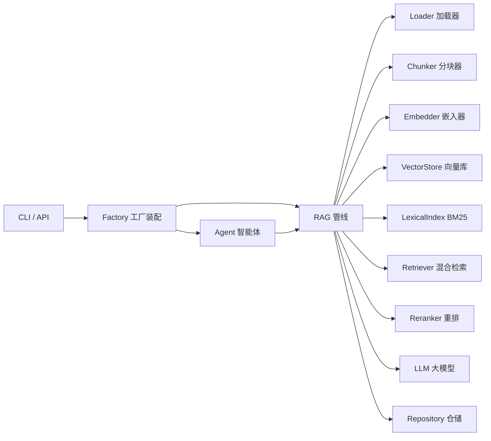

# Nebula AI Core

<p align="center">
  <a href="https://github.com/CJX0712/nebula-ai-core-0ef0/actions/workflows/ci.yml"></a>
  <a href="https://github.com/CJX0712/nebula-ai-core-0ef0/releases"></a>
  <a href="https://github.com/CJX0712/nebula-ai-core-0ef0/blob/main/LICENSE"></a>
  
</p>

> 端到端可运行的世界级 AI 引擎：加载 → 分块 → 嵌入 → 向量库 → 稀疏检索 → 混合检索 → 重排 → 大模型 → RAG → 智能体。
> **作者：晨星** ｜ 许可证：MIT

Nebula 不重复造轮子：默认实现零依赖、可离线复现；生产实现直接复用业界领先的开源成果（faiss-cpu / fastembed / llama-cpp-python / rank-bm25 / pypdf），通过环境变量一键切换。每个功能模块都是 `Protocol 接口 + 默认实现 + 可选生产实现`，运行时由工厂注入，因此**每个模块都可以独立验证，又能协同组成完整可运行链路**。

---

## 特性

- **单一职责模块化**：11 个 AI 功能模块，接口契约化（`typing.Protocol`），依赖只向下、只依赖抽象。
- **离线可复现**：默认后端（哈希 bigram 嵌入 / 内存向量 / 纯 Python BM25 / 抽取式大模型）无需网络、无需模型文件、无需 API Key，干净环境 `pip install -r requirements.txt` 即可跑通全部测试与 E2E。
- **复用开源旗舰**：生产环境切换 `NEBULA_EMBEDDER=fastembed`、`NEBULA_VECTOR_STORE=faiss`、`NEBULA_LLM=llamacpp` 即可接入真实语义嵌入、FAISS 近邻检索、本地 GGUF 大模型推理。
- **确定性工具路由 Agent**：智能体先识别算术表达式并调用计算器（避免小模型重算出错），其余走 RAG 知识路由。
- **完整交付**：可运行源码 + 锁版依赖（`requirements.txt` / `requirements-prod.txt` / `requirements.lock.txt`）+ 架构/部署/使用文档 + OpenAPI + ADR。

---

## 架构总览



| 模块 | 默认实现（离线） | 生产实现（复用开源） |
|------|------------------|----------------------|
| Embedder | `HashBigramEmbedder`（中文字 bigram 哈希） | `FastEmbedEmbedder`（fastembed / ONNX） |
| VectorStore | `MemoryVectorStore`（numpy 余弦） | `FaissVectorStore`（faiss-cpu） |
| LexicalIndex | `BM25Index`（纯 Python，idf 恒非负） | rank-bm25（可选） |
| LLM | `DeterministicLLM`（抽取式） | `LlamaCppLLM` / `OpenAICompatibleLLM` |
| Loader | Text / Markdown | `PDFLoader`（pypdf） |

详见 [ARCHITECTURE.md](./ARCHITECTURE.md) 与 [docs/SPEC.md](./docs/SPEC.md)。

---

## 目录结构

```
nebula-ai-core/
├── src/nebula/
│   ├── core/            # 11 个 AI 功能模块（Protocol + 实现）
│   │   ├── types.py        # 共享数据类型
│   │   ├── config.py       # 环境变量配置
│   │   ├── loader.py       # 加载器
│   │   ├── chunker.py      # 分块器
│   │   ├── embedder.py     # 嵌入器
│   │   ├── vectorstore.py  # 向量库
│   │   ├── lexical.py      # 稀疏检索(BM25)
│   │   ├── retriever.py    # 混合检索(RRF)
│   │   ├── reranker.py     # 重排
│   │   ├── llm.py          # 大模型后端
│   │   ├── repository.py   # 持久化
│   │   ├── rag.py          # RAG 管线编排
│   │   ├── agent.py        # 智能体编排
│   │   └── factory.py      # 依赖注入工厂（唯一装配点）
│   ├── api/             # FastAPI 服务（入口零业务）
│   └── cli.py           # 命令行入口
├── tests/              # 逐模块独立测试 + API E2E
├── tools/scan_emoji.py # P0 门禁：emoji 功能图标扫描
├── scripts/verify.py   # 自包含端到端验证
├── docs/               # SPEC / openapi / ADR
├── samples/            # 示例知识库
├── requirements.txt        # 默认运行时依赖（== 锁版）
├── requirements-prod.txt   # 生产后端依赖
├── requirements.lock.txt   # 已验证可安装的完整闭包
├── Dockerfile              # 生产部署镜像
└── LICENSE
```

---

## 快速开始

```bash
# 1) 安装默认依赖（最小闭包，离线可跑）
pip install -r requirements.txt
pip install -r requirements-dev.txt

# 2) 跑单元测试（25 passed，无网络无 Key）
pytest -q

# 3) P0 门禁 + 端到端验证（拉起应用跑成功流/错误流）
python tools/scan_emoji.py
python scripts/verify.py

# 4) 命令行
python -m nebula.cli ingest samples/sample.md
python -m nebula.cli query "什么是向量数据库？"
python -m nebula.cli agent "计算 12 * (3 + 4) = ?"

# 5) HTTP 服务
python -m nebula.cli serve --port 8000   # 打开 http://127.0.0.1:8000/docs
```

---

## 后端切换（复用开源成果）

编辑 `.env` 或导出环境变量（`NEBULA_` 前缀）：

| 变量 | 可选值 | 说明 |
|------|--------|------|
| `NEBULA_EMBEDDER` | `hash`（默认）\| `fastembed` | 语义嵌入 |
| `NEBULA_VECTOR_STORE` | `memory`（默认）\| `faiss` | 稠密检索 |
| `NEBULA_LEXICAL` | `bm25`（默认）\| `none` | 稀疏检索 |
| `NEBULA_LLM` | `deterministic`（默认）\| `llamacpp` \| `openai` | 生成 |
| `NEBULA_RERANKER` | `score`（默认）\| `none` | 重排 |

启用生产后端前先 `pip install -r requirements-prod.txt`：

```bash
# 本地 GGUF 大模型 + FAISS + fastembed 语义嵌入
export NEBULA_EMBEDDER=fastembed
export NEBULA_VECTOR_STORE=faiss
export NEBULA_LLM=llamacpp
export NEBULA_LLAMACPP_MODEL_PATH=/models/qwen2-0.5b-q4.gguf
python -m nebula.cli serve

# 或对接 Ollama / vLLM（OpenAI 兼容接口）
export NEBULA_LLM=openai
export NEBULA_OPENAI_BASE_URL=http://localhost:11434/v1
export NEBULA_OPENAI_MODEL=qwen2
```

---

## 部署指南

### 容器化部署

```bash
docker build -t nebula-ai-core .
docker run -p 8000:8000 \
  -e NEBULA_LLM=llamacpp \
  -e NEBULA_LLAMACPP_MODEL_PATH=/models/model.gguf \
  -v /absolute/models:/models \
  nebula-ai-core
```

服务暴露 `/health`、`/ingest`、`/query`、`/agent` 三个业务端点与 Swagger 文档 `/docs`（见 [docs/openapi.yaml](./docs/openapi.yaml)）。生产部署建议：
- 用 `requirements.lock.txt` 锁定完整闭包，保证可复现；
- 模型文件通过挂载卷注入，镜像本身不含权重；
- `vector_store` / `repository` 当前为进程内存储，多实例部署需替换为外部向量库 / 数据库（已在 [docs/decisions](./docs/decisions) 登记）。

### 健康检查

```bash
curl http://127.0.0.1:8000/health
# {"status":"ok","version":"1.0.0","llm":"deterministic",...,"indexed_chunks":0}
```

---

## 验证清单

| 项 | 命令 | 预期 |
|----|------|------|
| 单元测试 | `pytest -q` | 25 passed, 2 skipped |
| P0 门禁 | `python tools/scan_emoji.py` | status OK |
| 端到端 | `python scripts/verify.py` | E2E PASS |
| 生产后端 | 见 `requirements-prod.txt` | faiss / fastembed / llama-cpp 均 import 通过 |

---

## 许可证

MIT © 2026 晨星 (MorningStar)。详见 [LICENSE](./LICENSE)。
